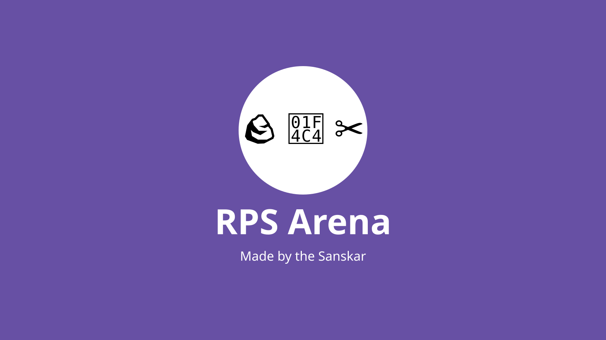

# RPS Arena

<p align="center">
  
</p>

<p align="center"><strong>Offline-first Rock Paper Scissors for Android and desktop — deterministic CPU challenges, local two-player play, timers, backups, and optional Lizard–Spock rules.</strong></p>

<p align="center">
  <a href="https://github.com/sanskarIN/rps-arena/actions"></a>
  <a href="LICENSE"></a>
  <a href="https://buymeacoffee.com/sanskarIN"></a>
</p>

## Preview

<p align="center">
  
</p>

Real device screenshots are release artifacts rather than fabricated mockups. The editable repository artwork remains in [`assets/`](assets/).

## Highlights

- Classic Rock–Paper–Scissors plus optional Rock–Paper–Scissors–Lizard–Spock.
- Player vs CPU and same-device two-player pass-and-play.
- Easy, Normal, and Expert CPU presets with transparent, local behavior.
- Best-of-3, Best-of-5, Endless, Streak, and Tournament modes.
- Replayable deterministic CPU challenges with an editable integer seed.
- Optional 5/10/20/30/60-second round timers with explicit timeout scoring.
- Offline aggregate statistics, recent 10-round W/L/D trends, history, achievements, settings, and onboarding.
- Versioned local backup/import for settings, statistics, and recent history.
- Local player-name preference and English/Hindi core UI catalogs.
- Light/dark/system theme options and reduced-motion result behavior.
- Transport-neutral private-room multiplayer architecture with a deterministic two-player in-memory reference adapter.
- Android + desktop from a Kotlin Multiplatform/Compose Multiplatform codebase.
- Optional standalone Rust rules engine for experimentation.
- No account, analytics SDK, ads SDK, cloud model, or Android internet permission in the primary app.
- Android automatic backup disabled; local SharedPreferences are excluded from cloud/device-transfer backup policy.
- No-op-by-default structured logger with sensitive-field redaction for any future opt-in diagnostic sink.
- CI-enforced formatting, docs links/file coverage, committed-secret patterns, Android privacy, versions, tests, lint/builds, and Rust checks.
- Separate dependency-review/security workflow plus CodeQL static analysis.
- Exhaustive repository documentation with CI-enforced coverage for every Git-tracked file.

## Supported platforms

| Platform | Status | Minimum / runtime |
|---|---|---|
| Android | Primary | API 26+; compile/target SDK 36 |
| Windows | Desktop | JVM 17 / Compose Desktop |
| Linux | Desktop | JVM 17 / Compose Desktop |
| macOS | Desktop | JVM 17 / Compose Desktop |
| iOS | Architecture-compatible future evaluation | Not part of the current release gate |

## Tech stack

- Kotlin 2.4.10
- Compose Multiplatform 1.11.0
- Kotlin Coroutines 1.10.2
- Android Gradle Plugin 9.3.0
- Gradle 9.5.1
- Android API 26+ / compile + target SDK 36
- Optional Rust 2024 edition rules engine

These are the repository's validated project baselines, not a claim that each number is globally the newest available version.

## Project structure

```text
androidApp/   Android entry point, manifest, adaptive icon, backup/privacy policy, packaging
desktopApp/   Desktop entry point and native packaging
shared/       Shared model, engine, state, persistence, logging, networking contracts, UI, tests
rust-engine/  Optional standalone Rust rules mirror
assets/       Editable logo and splash artwork
docs/         Deep architecture/platform/build/testing/maintenance/file documentation
scripts/      Source/security/privacy/version/documentation/full verification helpers
.github/      ownership, CI/security/CodeQL/release, Dependabot, issue/PR/funding configuration
gradle/       Version catalog
```

## Quick start

Requirements: JDK 17, a local Gradle compatible with the validated 9.5.1 baseline, Android SDK 36 for Android, Python 3 for repository checks, and a supported desktop OS.

The current repository does **not** track a Gradle Wrapper, so commands use `gradle` rather than `./gradlew`.

```bash
git clone https://github.com/sanskarIN/rps-arena.git
cd rps-arena
python3 scripts/check_format.py
python3 scripts/check_docs_links.py
python3 scripts/check_docs_coverage.py
python3 scripts/check_for_secrets.py
python3 scripts/check_android_privacy.py
python3 scripts/check_version.py
gradle :shared:allTests --stacktrace
gradle :desktopApp:run
```

Android debug build:

```bash
gradle :androidApp:assembleDebug --stacktrace
```

Full setup: [`docs/setup.md`](docs/setup.md)

Deep tool installation/upgrade guidance: [`docs/toolchain.md`](docs/toolchain.md)

Command meanings: [`docs/command-reference.md`](docs/command-reference.md)

Development workflow: [`docs/development.md`](docs/development.md)

## Complete documentation

Start with the role-based [`docs/documentation-index.md`](docs/documentation-index.md).

Deep references include:

- [`docs/build-system.md`](docs/build-system.md) — Gradle modules, version catalog, source sets, tasks, no-wrapper setup;
- [`docs/domain-and-gameplay.md`](docs/domain-and-gameplay.md) — models, rules, CPU probabilities, state machine, timers, scoring, invariants;
- [`docs/storage-and-backup.md`](docs/storage-and-backup.md) — exact keys, codecs, migration, history grammar, explicit backup schema/escaping/limits;
- [`docs/localization.md`](docs/localization.md) — English/Hindi catalogs, canonical vs localized data, adding languages;
- [`docs/private-room-protocol.md`](docs/private-room-protocol.md) — current no-network room contracts and future LAN security/fairness requirements;
- [`docs/android-platform.md`](docs/android-platform.md) — every Android app/resource/storage/backup-policy file;
- [`docs/desktop-platform.md`](docs/desktop-platform.md) — every desktop launcher/build/storage file;
- [`docs/rust-engine.md`](docs/rust-engine.md) — every optional Rust crate file and parity policy;
- [`docs/test-catalog.md`](docs/test-catalog.md) — every tracked automated Kotlin/Compose test and its regression responsibility;
- [`docs/ci-cd.md`](docs/ci-cd.md) — every `.github` ownership/automation/configuration file;
- [`docs/maintenance.md`](docs/maintenance.md) — long-term maintenance/change/release playbook;
- [`docs/glossary.md`](docs/glossary.md) — project/build/platform/security terminology;
- [`docs/branding-assets.md`](docs/branding-assets.md) — SVG/adaptive-icon/theme ownership;
- [`docs/repository-file-reference.md`](docs/repository-file-reference.md) — exhaustive every-tracked-file reference.

`python3 scripts/check_docs_coverage.py` uses `git ls-files` and fails CI if any tracked path is absent from the exhaustive file reference.

## CPU difficulty transparency

- **Easy:** random valid gesture.
- **Normal:** mostly random; after enough history it can counter the player's latest gesture.
- **Expert:** after enough history it estimates the player's most frequent allowed gesture and usually counters it while retaining randomness.

The CPU does not use internet services or hidden machine-learning models. Given the same seed, difficulty, ruleset, and player-move history, its random sequence is reproducible. Exact thresholds are documented in [`docs/domain-and-gameplay.md`](docs/domain-and-gameplay.md).

## Timed matches

Round timers are optional and can be disabled. In CPU mode, a player timeout awards the round to the CPU. In local two-player mode, the currently choosing player loses the timed turn. Timeout outcomes are typed, displayed, stored in history, and included in aggregate statistics.

## Backup and restore

Settings can prepare a plain-text, versioned local backup beginning with:

```text
RPS_ARENA_BACKUP|1
```

The importer validates size, record count, record types, duplicates, settings values, statistics invariants, and history bounds before replacing local state. Keep exported backup text private if a local player name or gameplay history is sensitive to you. Exact grammar is documented in [`docs/storage-and-backup.md`](docs/storage-and-backup.md).

Android automatic backup is disabled and SharedPreferences are excluded from legacy/cloud/device-transfer policy. The in-app backup text is therefore the explicit, user-controlled portability path rather than a hidden platform backup channel.

## Private-room architecture

The shared module contains `PrivateRoomGateway`/`PrivateRoomSession` transport contracts plus an in-memory reference implementation for deterministic testing and development. This is deliberately not a hidden network feature: the current primary Android app still declares no internet permission. A future LAN adapter must remain explicit and optional.

The current room contract is **not** production LAN multiplayer. See [`docs/private-room-protocol.md`](docs/private-room-protocol.md) for that boundary and future wire-protocol/security requirements.

## Testing and quality gates

```bash
python3 scripts/check_format.py
python3 scripts/check_docs_links.py
python3 scripts/check_docs_coverage.py
python3 scripts/check_for_secrets.py
python3 scripts/check_android_privacy.py
python3 scripts/check_version.py
gradle :shared:allTests --stacktrace
gradle :androidApp:lintDebug --stacktrace
gradle :androidApp:assembleDebug --stacktrace
gradle :desktopApp:classes --stacktrace
cargo test --manifest-path rust-engine/Cargo.toml --all-targets
```

Primary CI enforces the fast source/security/privacy/version gates plus shared tests, Android lint/build, desktop compilation, and Rust tests. The focused Security workflow independently rechecks secret/privacy contracts and performs pull-request dependency review. CodeQL separately performs Kotlin/Java security analysis. Tagged/manual release preflight repeats all fast source gates before packaging. See [`docs/testing.md`](docs/testing.md), [`docs/test-catalog.md`](docs/test-catalog.md), [`docs/validation.md`](docs/validation.md), and [`docs/ci-cd.md`](docs/ci-cd.md).

## Architecture

The primary flow is:

```text
Compose UI -> ArenaState -> RulesEngine / CpuStrategy
                       -> ArenaRepository -> PlatformStore
                       -> optional PrivateRoomGateway boundary
shared utilities      -> SafeLogger (no-op sink by default)
```

See [`docs/architecture.md`](docs/architecture.md), [`docs/build-system.md`](docs/build-system.md), and [`docs/adr/`](docs/adr/).

## Accessibility

RPS Arena uses visible text labels, large gesture targets, text-based outcome/timer feedback, optional timers, light/dark/system themes, and reduced-motion behavior. Manual keyboard/TalkBack/text-scaling review steps are documented in [`docs/accessibility.md`](docs/accessibility.md).

## Privacy and security

RPS Arena is offline-first. Local storage contains preferences, aggregate statistics, and up to 30 recent round summaries. The primary Android app has no internet permission, disables automatic backup, and excludes SharedPreferences from cloud/device-transfer policy. Repository checks fail if those Android privacy invariants regress or recognizable high-confidence credential material is committed. See [`PRIVACY.md`](PRIVACY.md), [`SECURITY.md`](SECURITY.md), [`docs/android-platform.md`](docs/android-platform.md), and [`docs/storage-and-backup.md`](docs/storage-and-backup.md).

## Release

Version 2.5.8 is configured for Android and desktop. Android uses `versionCode = 20508`; tagged releases can build unsigned/public Android, Linux desktop, and Rust package artifacts with SHA-256 checksums after repeating the fast source/security/privacy/version preflight. Store signing/notarization requires private credentials supplied outside the repository. See [`docs/release.md`](docs/release.md) and [`docs/ci-cd.md`](docs/ci-cd.md).

## Roadmap

See [`ROADMAP.md`](ROADMAP.md). Future networking and signing work must remain optional and credential-safe.

## Contributing

Read [`CONTRIBUTING.md`](CONTRIBUTING.md), [`CODE_OF_CONDUCT.md`](CODE_OF_CONDUCT.md), [`SECURITY.md`](SECURITY.md), and [`docs/maintenance.md`](docs/maintenance.md). The documented owner commit email is `sanskarin@outlook.in`.

Any new tracked file must also be documented in [`docs/repository-file-reference.md`](docs/repository-file-reference.md). `.github/CODEOWNERS` routes maintainer review ownership; repository rules can make code-owner approval mandatory.

## Support and contact

- Business: `sanskarin@outlook.in`
- Business: `sanskarin.business@gmail.com`
- Support: `supportramsandesh@gmail.com`
- GitHub: <https://github.com/sanskarIN>
- Repository: <https://github.com/sanskarIN/rps-arena>
- **Buy Me a Coffee:** <https://buymeacoffee.com/sanskarIN>

[](https://buymeacoffee.com/sanskarIN)

## License

MIT. See [`LICENSE`](LICENSE).

**Made by the Sanskar.**
